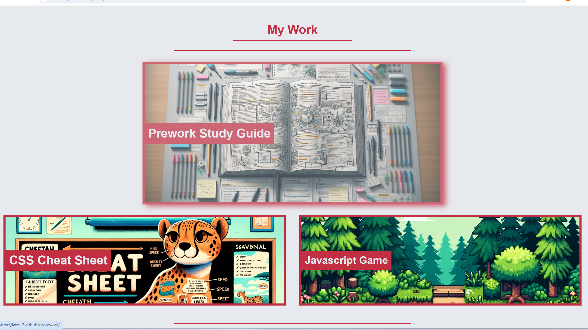
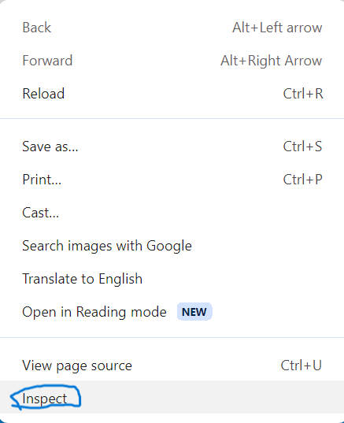
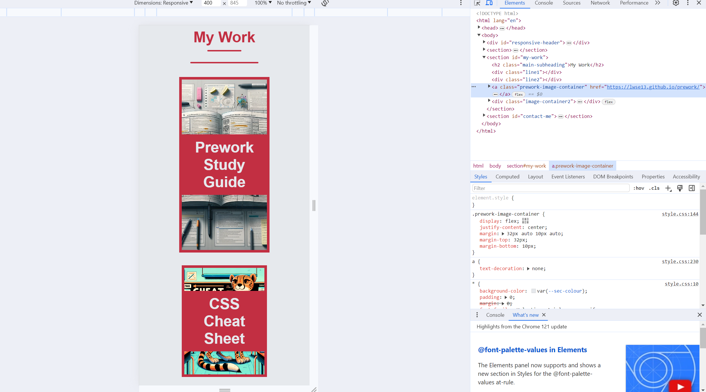

# My Project Portfolio

## Description
I was motivated to create this portfolio in order to showcase my work as a developer and to also gain experience in building my first webpage using HTML and CSS. For the first time I have also designed a responsive layout for small screens viewing my webpage and used psuedoclasses to customise my links.

This webpage houses all of my work and information about me in one place and gives me a way of showcasing my skills to potential employers.
One of the main challenges I experienced whilst creating this webpage was understanding the use of flexbox and general positioning. It provoked me to read documentation and do my research to get a better understanding. As I was half way through my "my work" section everything started to click and I was flying through my work. This has also been a great oppurtunity for me to gain a deeper understanding of media queries and psuedoclasses. aswell as understanding where I should position my CSS classes within the stylesheet.

In the future I would like to switch up my design layout and colours aswell as adding new projects some of which I have a glimpse of within my wepbape...

## Installation
N/A

## Usage
The website can be found here!: (https://lwse13.github.io/Lees-Programming-Portfolio/)

The webpage's index.html and style.css can be opened in VS code. Alternatively, you can use any modern browser's "inspect" function to look into the code. To do this right click on a webpage and click "inspect" to open the console.

   

## Credits
N/A

## License#
N/A
